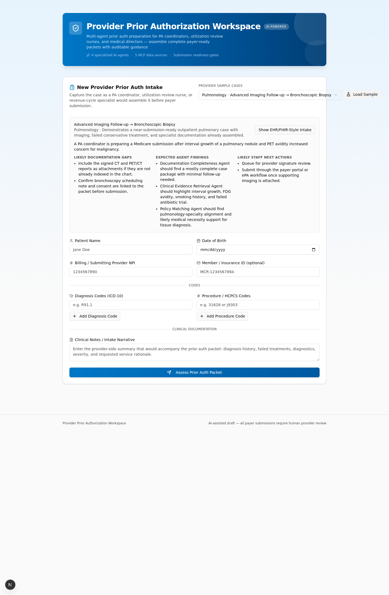

# Architecture

## Multi-Agent Architecture

The application uses a **pure HTTP dispatch** architecture. The FastAPI backend has no local AI runtime — all specialist reasoning runs in four independent Foundry Hosted Agent containers.

- **Frontend + FastAPI backend/orchestrator run in Azure Container Apps**
- **Each of the 4 specialist agents is a standalone Foundry Hosted Agent** (independent container, independently scalable)
- **The backend owns**: SSE progress streaming, review persistence, decision handling, audit PDF generation, and HTTP dispatch to the agent containers

```
┌────────────────────────────────────────────────────────────────────┐
│ Next.js Frontend (ACA)                                            │
│ UploadForm → POST /api/review/stream → ProgressTracker            │
│ ReviewDashboard → DecisionPanel → PDF downloads                   │
└──────────────────────────────┬─────────────────────────────────────┘
                               │ REST + SSE
┌──────────────────────────────▼─────────────────────────────────────┐
│ FastAPI Backend + Orchestrator (ACA)                              │
│ - Pre-flight validation                                           │
│ - Phase orchestration and retries                                 │
│ - SSE progress events                                             │
│ - Review store + decision handling                                │
│ - Audit/PDF generation                                            │
└───────────────┬───────────────────────────────┬────────────────────┘
                │                               │
  POST agent Responses endpoint  │ OpenTelemetry
  (Foundry Hosted Agents)        │
┌───────────────▼───────────────────────────────────────────────┐
│ Microsoft Foundry Hosted Agents (gpt-5.4)                     │
│ - Compliance Agent   (pure LLM, no tools)                     │
│ - Clinical Reviewer Agent  ─┐ tool-calling                    │
│ - Coverage Assessment Agent ┘ via Foundry Toolbox             │
│ - Synthesis Agent    (pure LLM, no tools)                     │
│ - Native evaluation / lifecycle / control-plane visibility    │
└───────────────┬───────────────────────────────────────────────┘
                │ MCP client (clinical-tools / coverage-tools toolbox)
┌───────────────▼───────────────────────────────────────────────┐
│ Foundry Toolbox (managed MCP endpoint on project domain)      │
│ proxies out to:                                               │
│   • medical-data MCP container app (ICD-10 • Clinical Trials  │
│     • NPI • CMS Coverage)                                     │
│   • PubMed (pubmed.mcp.claude.com)                            │
└───────────────────────────────────────────────────────────────┘
```

## Project Structure

```
prior-auth-maf/
├── backend/               # FastAPI orchestrator — SSE streaming, review dashboard, audit PDF
│   ├── app/
│   │   ├── agents/        # HTTP dispatchers to hosted agent containers + orchestrator
│   │   ├── routers/       # /review, /decision, /agents endpoints
│   │   ├── services/      # hosted_agents.py HTTP dispatch, audit_pdf.py, cpt_validation.py, notification.py
│   │   └── models/        # Pydantic schemas (schemas.py)
│   └── Dockerfile
│
├── agents/                # Four independent Foundry Hosted Agent deployable units
│   ├── clinical/          # ICD-10, PubMed, Clinical Trials via clinical-tools toolbox
│   │   ├── main.py        # azure-ai-agentserver host + responses.parse(text_format=ClinicalResult)
│   │   ├── mcp_toolbox.py # MCP client to the Foundry Toolbox + tool-calling loop
│   │   ├── schemas.py     # Pydantic output model (ClinicalResult)
│   │   ├── Dockerfile
│   │   ├── agent.yaml     # Foundry Hosted Agent descriptor
│   │   └── skills/clinical-review/SKILL.md
│   ├── coverage/          # NPI Registry, CMS Coverage via coverage-tools toolbox
│   │   ├── main.py
│   │   ├── mcp_toolbox.py
│   │   ├── schemas.py     # Pydantic output model (CoverageResult)
│   │   ├── Dockerfile
│   │   ├── agent.yaml
│   │   └── skills/coverage-assessment/SKILL.md
│   ├── compliance/        # No tools — pure LLM reasoning
│   │   ├── main.py
│   │   ├── schemas.py     # Pydantic output model (ComplianceResult)
│   │   ├── Dockerfile
│   │   ├── agent.yaml
│   │   └── skills/compliance-review/SKILL.md
│   └── synthesis/         # No tools — gate-based synthesis (pure LLM)
│       ├── main.py
│       ├── schemas.py     # Pydantic output model (SynthesisOutput)
│       ├── Dockerfile
│       ├── agent.yaml
│       └── skills/synthesis-decision/SKILL.md
│
├── mcp-servers/
│   └── medical-data/      # Self-hosted MCP server (ICD-10, Clinical Trials, NPI, CMS Coverage)
│       └── server.py
├── frontend/              # Next.js UI
├── scripts/               # Post-provision helpers
│   ├── register_agents.py # Registers all 4 agents + creates MCP project connections
│   ├── create_toolbox.py  # Creates the clinical-tools / coverage-tools Foundry Toolboxes
│   └── check_agents.py    # Pre-flight health check — agents, App Insights, MCP, backend, frontend
├── docs/                  # Architecture, deployment guide, API reference
├── infra/                 # Bicep / azd infrastructure
└── docker-compose.yml     # Local: backend + 4 agents + frontend
```

## Where This Fits in a Provider Organization

This accelerator is designed to sit **between existing provider systems and the payer submission workflow**. It does not replace the EHR, referral platform, revenue cycle work queue, or document repository. Instead, it helps the provider team assemble a stronger, more complete submission packet.

| Provider source | Example system responsibility | How this solution integrates |
|-----------------|-------------------------------|------------------------------|
| EHR / EMR | Patient demographics, coverage, encounters, notes, observations, orders | Supplies the core case payload and supporting clinical documentation |
| Referral / surgery / infusion platform | Authorization work queues, scheduling context, servicing location, status tracking | Triggers review before a packet is submitted or resubmitted |
| Document management / fax intake | Referral packets, payer forms, scanned records, imaging reports | Contributes attachment metadata and missing-document follow-up |
| Medical director / physician reviewer workflow | Escalations, peer-to-peer prep, override rationale | Consumes the synthesis summary and preserves human revision decisions |
| Revenue cycle / authorization operations | Submission status, payer follow-up, denial prevention | Uses the output summary, documentation gaps, and audit trail in downstream work queues |

## Target-State Provider Architecture

### Lightweight deployment

Use this when a provider wants to trial the workflow with a small intake team or a narrow specialty line.

```text
EHR / Referral Queue / Fax Intake
            │
            ▼
 Provider Intake UI + FastAPI Orchestrator
            │
            ▼
 4 Hosted Agents + MCP Data Tools
            │
            ▼
 Staff reviewer submits through payer portal/API
```

### Production-integrated deployment

Use this when the provider wants the accelerator embedded into existing operational systems.

```text
FHIR APIs / HL7 v2 / Batch Documents / Referral Platform
                    │
                    ▼
        Integration layer / event routing
                    │
                    ▼
 Provider Prior Auth Orchestrator + Hosted Agents
          │                │                 │
          │                │                 └──► Audit PDFs / letters / override record
          │                └──► Documentation gaps + readiness status
          └──► Callback / webhook to EHR, RCM queue, referral worklist, or payer submission service
```

In the production-integrated pattern, the same review can be triggered:
- when a new order enters a PA-required work queue
- when additional documentation is attached after a payer pend
- when a physician reviewer needs an auditable summary before revising the recommendation

## How It Works


*The Prior Authorization Review interface showing the PA request form, real-time agent progress tracking, review dashboard with agent details, and the human-in-the-loop decision panel.*

1. A PA coordinator, utilization review nurse, or physician reviewer fills in the PA intake form in the Next.js frontend, or loads one of several provider sample cases (advanced imaging, specialty drug / infusion, outpatient surgery, or DME / home oxygen). The form supports both a simple intake path and an **advanced EHR/FHIR-style intake** with ordering-provider, payer, servicing-location, document-type, urgency, and treatment-history fields.

2. The frontend POSTs to `POST /api/review/stream` on the FastAPI backend,
   opening an SSE (Server-Sent Events) connection for real-time progress.

3. The **Orchestrator** runs a pre-flight check and then dispatches the
    four specialist agents. `hosted_agents.py` uses a **two-mode dispatcher**:
    - **Docker Compose (local dev):** direct `POST {HOSTED_AGENT_*_URL}/responses` to each agent container over the Docker bridge network.
    - **Foundry Hosted Agents (production):** `POST {project_endpoint}/agents/{agentName}/endpoint/protocols/openai/responses?api-version=v1` — the agent name is part of the endpoint path, so no `agent_reference`, `model`, or `agent` is passed in the body. Authentication is via `DefaultAzureCredential` (the backend ACA managed identity), with header `Foundry-Features: HostedAgents=V1Preview`. The dispatcher parses both JSON and (defensively) SSE response bodies.

    Each agent container is built on the `azure-ai-agentserver` Responses
    protocol host (protocol version `1.0.0`). The **Clinical Reviewer** and
    **Coverage** agents drive the model with the OpenAI SDK via
    `client.responses.parse(text_format=PydanticModel)` against
    `{AZURE_AI_PROJECT_ENDPOINT}/openai/v1` (auth via the agent managed identity,
    scope `https://ai.azure.com/.default`), running a tool-calling loop over their
    Foundry Toolbox tools. The **Compliance** and **Synthesis** agents use the
    Microsoft Agent Framework (`AzureOpenAIResponsesClient` with
    `default_options={"response_format": PydanticModel}`) and call no tools. Both
    paths enforce token-level structured output; the backend parses the result
    JSON from the Responses output text.

   **Pre-flight — CPT/HCPCS Format Validation** (`cpt_validation.py`):
   - Validates procedure code format (5-digit CPT or letter+4 HCPCS)
   - Looks up codes against a curated table of ~30 common PA-trigger codes
   - Invalid format codes are flagged before any agent runs
   - Results are injected into the synthesis prompt for Gate 2 evaluation

    **Phase 1 — Parallel execution** (`asyncio.gather`):
    - **Compliance Agent** — validates documentation completeness
    - **Clinical Reviewer Agent** — validates diagnosis codes, extracts clinical data with confidence scoring, and searches literature/trials

    **Phase 2 — Sequential** (depends on clinical findings):
    - **Coverage Agent** — verifies provider, searches coverage policies, maps evidence to criteria

   **Phase 3 — Synthesis** (gate-based decision rubric):
   - Gate 1 (Provider) → Gate 2 (Codes) → Gate 3 (Medical Necessity)
   - Produces APPROVE or PEND recommendation with confidence score

   **Phase 4 — Audit trail and justification**:
   - Computes overall confidence, builds audit trail, generates audit justification document (Markdown + PDF)

4. The normalized synthesis payload is persisted in the review store for later retrieval.

5. Frontend displays real-time progress tracker with phase timeline and agent cards.

6. Review dashboard shows recommendation, agent details in four tabs (Compliance checklist, Clinical extraction, Coverage criteria, **Synthesis** gate pipeline + confidence breakdown), and audit justification download.

7. Decision Panel supports provider staff submit-or-revise flow with notification letter generation and override traceability.

---

## MCP Integration

The clinical and coverage agents reach their MCP tools through **Foundry Toolboxes**.
A Foundry Toolbox is a managed MCP endpoint *on the Foundry project domain*
(`{project_endpoint}/toolboxes/{name}/mcp?api-version=v1`) that proxies out to the
backing MCP servers from Foundry's own network. Hosted agents can reach the Foundry
project domain but not arbitrary public internet, so the toolbox is the bridge.

The agent consumes the toolbox as an **MCP client** (streamable-HTTP): it connects
with its managed-identity bearer token plus the header
`Foundry-Features: Toolboxes=V1Preview`, lists the toolbox's tools, and runs a
tool-calling loop driven by `client.responses.parse(...)`. (The toolbox endpoint
**cannot** be passed as a Responses API `type: mcp` `server_url` — it is consumed by
an MCP client, not the model backend.) The MCP `ClientSession` is opened and closed
inside a single request handler coroutine via `AsyncExitStack`; opening and tearing
it down in the same task avoids cross-task anyio teardown errors.

- **`clinical-tools`** backs the clinical agent: `icd10`, `pubmed`, `clinical_trials`.
- **`coverage-tools`** backs the coverage agent: `npi`, `cms_coverage`.

Tools are exposed to the model as `{server_label}___{tool_name}`
(e.g. `npi___npi_validate`, `icd10___validate_code`). All medical-data tools are
read-only (search / validate / lookup), so toolboxes are created with
`require_approval="never"`.

### Tool-calling loop (reasoning-safe)

gpt-5.x are reasoning models, so the loop continues each turn with
`previous_response_id` (server-stored conversation + reasoning state) rather than
re-sending the message list — a stateless input list would drop the reasoning items
and error. If the tool budget (`max_iters`) is exhausted the agent forces a final
structured answer without tools.

### Resilience

A tool or model failure never produces an HTTP 500 to Foundry. Each agent's request
handler wraps the run in a `try/except`; on any failure it emits a schema-valid
**degraded** result (a conservative manual-review payload) with HTTP 200, so the
orchestrator always receives a parseable result.

### How MCP Tools Are Provisioned

During `azd up`:

1. `scripts/register_agents.py` **creates Foundry MCP project connections** via the
   ARM REST API (idempotent PUT) for each backing server (portal visibility under
   **Build → Tools**) and **registers each agent**, injecting `TOOLBOX_ENDPOINT`
   (and the `MCP_*` URLs the toolboxes point at) as environment variables.
2. `scripts/create_toolbox.py` **creates/verifies the toolboxes** `clinical-tools`
   and `coverage-tools`, then runs a representative read-only call against each to
   prove the proxy reaches the backing servers.

```python
# scripts/register_agents.py (simplified)

toolbox_clinical = f"{project_endpoint}/toolboxes/clinical-tools/mcp?api-version=v1"

agent = client.agents.create_version(
    agent_name="clinical-reviewer-agent",
    definition=HostedAgentDefinition(
        ...,
        environment_variables={
            "TOOLBOX_ENDPOINT": toolbox_clinical,
            "MCP_ICD10_CODES": f"{MEDICAL_MCP_BASE_URL}/icd10/mcp",
            "MCP_PUBMED": "https://pubmed.mcp.claude.com/mcp",
            "MCP_CLINICAL_TRIALS": f"{MEDICAL_MCP_BASE_URL}/clinical_trials/mcp",
        },
        tools=[],  # tools are consumed via the toolbox MCP client, not HostedAgentDefinition
    ),
)
```

### Backing MCP servers

| Toolbox | Server label | Backing server | Auth |
|---------|--------------|----------------|------|
| `clinical-tools` | `icd10`, `clinical_trials` | Self-hosted medical-data MCP container app | None (read-only public data) |
| `clinical-tools` | `pubmed` | `pubmed.mcp.claude.com` (Anthropic-hosted) | Unauthenticated |
| `coverage-tools` | `npi`, `cms_coverage` | Self-hosted medical-data MCP container app | None (read-only public data) |

The self-hosted **medical-data** MCP server (Azure Container App; MCP Streamable HTTP,
stateless, JSON responses) serves each domain on its own path — `/icd10/mcp`,
`/clinical_trials/mcp`, `/npi/mcp`, `/cms_coverage/mcp`, plus `/health`. It is a thin
wrapper over official free public APIs and holds no secrets:

- **ICD-10** — NLM Clinical Tables (ICD-10-CM / PCS)
- **Clinical Trials** — ClinicalTrials.gov API v2
- **NPI** — CMS NPPES Registry API (local Luhn check + lookup/search)
- **CMS Coverage** — CMS Coverage API (`api.coverage.cms.gov`, real NCD/LCD/Article data)

---

## Agent Details

Each agent's execution is fully transparent in the frontend with Checks Summary tables.

### Compliance Agent

| Property | Value |
|----------|-------|
| **Role** | Documentation completeness validation |
| **Tools** | None (pure LLM reasoning) |
| **Model call** | Microsoft Agent Framework `AzureOpenAIResponsesClient` with `default_options={"response_format": ComplianceResult}` |
| **Input** | Raw PA request data |
| **Output** | Checklist (10 items), missing items, additional-info requests |

**SKILL.md rules (always shown in Checks Summary):**

| # | Rule | What it checks |
|---|------|----------------|
| 1 | Patient Information | Name and DOB present and non-empty |
| 2 | Provider NPI | NPI present and exactly 10 digits |
| 3 | Insurance ID (non-blocking) | Insurance ID provided (informational only) |
| 4 | Diagnosis Codes | At least one ICD-10 code with valid format |
| 5 | Procedure Codes | At least one CPT/HCPCS code provided |
| 6 | Clinical Notes Presence | Substantive clinical narrative (not just codes) |
| 7 | Clinical Notes Quality | Meaningful detail; boilerplate/copy-paste detection |
| 8 | Insurance Plan Type (non-blocking) | Medicare/Medicaid/Commercial/MA identification |
| 9 | NCCI Edit Awareness (non-blocking) | Flags multi-CPT bundling risk; defers full NCCI validation to Coverage Agent |
| 10 | Service Type (non-blocking) | Classifies as Procedure/Medication/Imaging/Device/Therapy/Facility for downstream policy routing |

### Clinical Reviewer Agent

| Property | Value |
|----------|-------|
| **Role** | Clinical data extraction, code validation, confidence scoring, clinical trials search |
| **Toolbox** | `clinical-tools` (server labels `icd10`, `pubmed`, `clinical_trials`) |
| **Tools** | `icd10`: `validate_code`, `lookup_code`, `search_codes`, `get_hierarchy`; `pubmed`: `search_articles` and related PubMed tools; `clinical_trials`: `search_trials`, `get_trial_details` |
| **Model call** | Reasoning-safe tool-calling loop (`max_iters=8`) via `responses.parse(text_format=ClinicalResult)` |

**SKILL.md rules:**

| # | Rule | MCP tools used | Sub-items |
|---|------|---------------|-----------|
| 1 | ICD-10 Diagnosis Code Validation | `validate_code`, `lookup_code`, `get_hierarchy` | Per-code sub-items |
| 2 | CPT/HCPCS Procedure Code Notation | (orchestrator pre-flight) | Pre-flight results |
| 3 | Clinical Data Extraction | None (reasoning) | 8 sub-items |
| 4 | Extraction Confidence Calculation | None (reasoning) | Low-confidence warning if < 60% |
| 5 | PubMed Literature Search | `search_articles` (`pubmed`) | Supplementary, non-blocking |
| 6 | Clinical Trials Search | `search_trials`, `get_trial_details` (`clinical_trials`) | Supplementary, non-blocking |
| 7 | Clinical Summary Generation | None (reasoning) | Final structured narrative |

### Coverage Agent

| Property | Value |
|----------|-------|
| **Role** | Provider verification, coverage policy assessment, criteria mapping, diagnosis-policy alignment |
| **Toolbox** | `coverage-tools` (server labels `npi`, `cms_coverage`) |
| **Tools** | `npi`: `npi_validate`, `npi_lookup`, `npi_search`; `cms_coverage`: `search_national_coverage`, `search_local_coverage`, `get_coverage_document`, `get_contractors` |
| **Model call** | Reasoning-safe tool-calling loop (`max_iters=8`) via `responses.parse(text_format=CoverageResult)` |

**SKILL.md rules:**

| # | Rule | MCP tools used | Sub-items |
|---|------|---------------|-----------|
| 1 | Provider NPI Verification | `npi_validate`, `npi_lookup` | Format check + NPPES lookup |
| 1.4 | Provider Specialty-Procedure Appropriateness **(REQUIRED)** | `npi_lookup` taxonomy | Emitted as an explicit `criteria_assessment` entry: `MET`/`NOT_MET`/`INSUFFICIENT` based on NPI taxonomy vs. requested CPT category |
| 2 | MAC Identification | `get_contractors` | State-based MAC lookup |
| 3 | Coverage Policy Search | `search_national_coverage`, `search_local_coverage` | NCD and LCD searches |
| 4 | Policy Detail Retrieval | `get_coverage_document` | Full policy text + covered/non-covered ICD-10 and HCPCS |
| 5 | Clinical Evidence to Criteria Mapping | None (reasoning) | Per-criterion MET/NOT_MET/INSUFFICIENT |
| 6 | Diagnosis-Policy Alignment **(AUDITABLE, REQUIRED)** | None (reasoning) | ICD-10 vs. policy indications |
| 7 | Documentation Gap Analysis | None (reasoning) | Critical vs. non-critical |

**Criteria evaluation:**
- **MET** (confidence >= 70): Clinical evidence clearly supports the requirement
- **NOT_MET** (any confidence): Evidence contradicts the requirement
- **INSUFFICIENT** (confidence < 70): Evidence absent or ambiguous

### Orchestrator (Synthesis)

| Property | Value |
|----------|-------|
| **Role** | Pre-flight CPT validation (orchestrator), coordinate agents, apply gate-based decision rubric |
| **Tools** | CPT format validation (local, orchestrator pre-flight); synthesis agent itself has no tools (pure LLM) |
| **Model call** | Microsoft Agent Framework `AzureOpenAIResponsesClient` with `default_options={"response_format": SynthesisOutput}` |
| **Input** | All three agent reports + CPT validation results |
| **Output** | APPROVE/PEND recommendation, confidence (0-1.0 + HIGH/MEDIUM/LOW), rationale, `synthesis_audit_trail` (gate_results + confidence_components), disclaimer |

---

## Decision Rubric — LENIENT Mode (Default)

Evaluated in gate order. Stops at first failing gate:

**Gate 1 — Provider Verification:**

| Scenario | Action |
|----------|--------|
| Provider NPI valid and active | PASS — continue to Gate 2 |
| Provider NPI invalid or inactive | PEND — request credentialing info |

**Gate 2 — Code Validation:**

| Scenario | Action |
|----------|--------|
| All ICD-10 codes valid and billable | PASS — continue to Gate 3 |
| Any ICD-10 code invalid | PEND — request diagnosis code clarification |
| All CPT/HCPCS codes valid format | PASS — continue to Gate 3 |
| Any CPT/HCPCS code invalid format | PEND — request procedure code clarification |

**Gate 3 — Medical Necessity:**

| Scenario | Action |
|----------|--------|
| All required criteria MET | APPROVE |
| Any criterion NOT_MET | PEND — request additional documentation |
| Any criterion INSUFFICIENT | PEND — specify what documentation is needed |
| No coverage policy found, strong clinical evidence | APPROVE — under general medical necessity §1862(a)(1)(A) |
| No coverage policy found, weak clinical evidence | PEND — request additional clinical justification |
| Documentation incomplete | PEND — specify missing items |
| Uncertain or conflicting signals | PEND — default safe option |

The system **never recommends DENY** — only APPROVE or PEND FOR REVIEW.

> **Note:** Most Medicare procedures (~80%+) have no specific LCD/NCD. When no
> coverage policy exists, Gate 3 uses a **medical necessity fallback** (Path B)
> that evaluates clinical evidence directly — documented progression, failed
> conservative treatment, objective findings, and provider specialty alignment.
> This mirrors real-world PA workflows where coverage falls under Medicare's
> general "reasonable and necessary" standard.

---

## Confidence Scoring

| Level | Range | Meaning |
|-------|-------|---------|
| **HIGH** | 0.80 - 1.0 | All criteria MET with high confidence, no gaps |
| **MEDIUM** | 0.50 - 0.79 | Most criteria MET but some with moderate evidence |
| **LOW** | 0.0 - 0.49 | Significant gaps, INSUFFICIENT criteria, or agent errors |

Computed from a weighted formula:

```
overall = (0.4 × avg_criteria / 100) + (0.3 × extraction / 100)
        + (0.2 × compliance_score) + (0.1 × policy_match)
```

Where `policy_match` uses a 4-tier scale: 1.0 (policy found + aligned),
0.75 (no policy but medical necessity passes), 0.5 (policy but unclear
alignment), 0.25 (no policy, borderline necessity), 0.0 (NOT_MET).
See [synthesis-decision SKILL.md](../agents/synthesis/skills/synthesis-decision/SKILL.md)
for the step-by-step calculation with worked examples.

---

## Audit Justification Document

The orchestrator generates a structured audit document (Markdown + PDF) with 8 sections:

1. **Executive Summary** — patient, provider, decision, confidence
2. **Medical Necessity Assessment** — provider info, coverage policies, clinical evidence, Literature Support, Clinical Trials
3. **Criterion-by-Criterion Evaluation** — each criterion with status, confidence, evidence
4. **Validation Checks** — provider NPI, diagnosis codes, compliance checklist
5. **Decision Rationale** — decision gates with color-coded PASS/FAIL labels, confidence, supporting facts
6. **Documentation Gaps** — structured gaps, critical/non-critical labels
7. **Audit Trail** — data sources, timestamps, confidence metrics
8. **Regulatory Compliance** — decision policy and requirements

---

## Medical-Data MCP Tools

The self-hosted **medical-data** MCP server (Azure Container App) backs four of the
five tool domains; PubMed is consumed from the Anthropic-hosted server. Agents reach
all of them through the `clinical-tools` / `coverage-tools` Foundry Toolboxes.

| Server label | Path / endpoint | Data source | Used by | Tools |
|---|---|---|---|---|
| `npi` | `<medical-data>/npi/mcp` | CMS NPPES Registry | Coverage Agent | `npi_validate`, `npi_lookup`, `npi_search` |
| `cms_coverage` | `<medical-data>/cms_coverage/mcp` | CMS Coverage API (`api.coverage.cms.gov`) | Coverage Agent | `search_national_coverage`, `search_local_coverage`, `get_coverage_document`, `get_contractors` |
| `icd10` | `<medical-data>/icd10/mcp` | NLM Clinical Tables (ICD-10-CM / PCS) | Clinical Agent | `validate_code`, `lookup_code`, `search_codes`, `get_hierarchy` |
| `clinical_trials` | `<medical-data>/clinical_trials/mcp` | ClinicalTrials.gov API v2 | Clinical Agent | `search_trials`, `get_trial_details` |
| `pubmed` | `pubmed.mcp.claude.com/mcp` | Anthropic-hosted PubMed MCP | Clinical Agent | `search_articles`, `get_article_metadata`, `find_related_articles`, `lookup_article_by_citation`, `convert_article_ids`, `get_full_text_article`, `get_copyright_status` |

`<medical-data>` is the medical-data container app FQDN, injected at registration time
via `MEDICAL_MCP_BASE_URL` (set by Bicep from the container app FQDN).

### How MCP Is Integrated

```
agents/<name>/main.py + mcp_toolbox.py
    │  MCP client (streamable-HTTP) → Foundry Toolbox
    ▼
{project_endpoint}/toolboxes/{clinical-tools|coverage-tools}/mcp?api-version=v1
    │  Foundry proxies out from its own network
    ▼
medical-data MCP container app (icd10, clinical_trials, npi, cms_coverage)
PubMed (pubmed.mcp.claude.com)

scripts/register_agents.py — Creates Foundry MCP project connections (portal visibility),
                             registers agents with TOOLBOX_ENDPOINT + MCP_* env vars
scripts/create_toolbox.py  — Creates/verifies the clinical-tools / coverage-tools toolboxes
```

---

## Skills-Based Architecture

Agent behaviors are defined in SKILL.md files — domain experts can update clinical rules without code changes.
Each agent loads its `skills/<name>/SKILL.md` at startup; the skill body is the source of truth for the
workflow. The Clinical Reviewer and Coverage agents read the file and inline it into the system prompt; the
Compliance and Synthesis agents load it through the Microsoft Agent Framework `SkillsProvider`:

```python
# Clinical Reviewer / Coverage — inline the skill into the system prompt
system_prompt = _BASE_INSTRUCTIONS + "\n\n# Skill: clinical-review\n\n" + _load_skill()

# Compliance / Synthesis — load the skill via the Microsoft Agent Framework
skills_provider = SkillsProvider(...)
```

### Skills Overview

| Skill | Directory | Toolbox | Purpose |
|-------|-----------|---------|---------|
| Compliance Review | `agents/compliance/skills/compliance-review/` | None | 10-item documentation completeness checklist (items 1-7 blocking; 8 plan type, 9 NCCI bundling, 10 service type — non-blocking) |
| Clinical Review | `agents/clinical/skills/clinical-review/` | `clinical-tools` (icd10, pubmed, clinical_trials) | Code validation, clinical extraction, low-confidence warning (< 60%), literature + trials |
| Coverage Assessment | `agents/coverage/skills/coverage-assessment/` | `coverage-tools` (npi, cms_coverage) | Provider verification, specialty-procedure match, policy search, criteria mapping, Diagnosis-Policy Alignment |
| Synthesis Decision | `agents/synthesis/skills/synthesis-decision/` | None | Gate-based evaluation, weighted confidence, `synthesis_audit_trail` breakdown, final recommendation + disclaimer |

---

## Project Structure

```
prior-auth-maf/
├── backend/
│   ├── .env                              # Environment config (not committed)
│   ├── requirements.txt                  # Python dependencies
│   └── app/
│       ├── main.py                       # FastAPI app, CORS, router mounts
│       ├── config.py                     # Settings (agent URLs, auth, App Insights)
│       ├── observability.py              # Azure App Insights + OpenTelemetry
│       ├── agents/
│       │   ├── clinical_agent.py         # HTTP dispatcher → Clinical hosted agent
│       │   ├── compliance_agent.py       # HTTP dispatcher → Compliance hosted agent
│       │   ├── coverage_agent.py         # HTTP dispatcher → Coverage hosted agent
│       │   ├── synthesis_agent.py        # HTTP dispatcher → Synthesis hosted agent
│       │   └── orchestrator.py           # Multi-agent coordinator + audit trail
│       ├── services/
│       │   ├── hosted_agents.py          # Two-mode dispatcher: direct HTTP (docker-compose) or Foundry agent-specific Responses endpoint (production)
│       │   ├── audit_pdf.py              # Audit justification PDF (fpdf2)
│       │   ├── cpt_validation.py         # CPT/HCPCS format validation (pre-flight)
│       │   └── notification.py           # Notification letters + PDF
│       ├── models/
│       │   └── schemas.py                # Pydantic models (single source of truth)
│       └── routers/
│           ├── review.py                 # POST /api/review + SSE streaming
│           ├── decision.py               # POST /api/decision
│           └── agents.py                 # Per-agent endpoints /api/agents/*
│
├── agents/
│   ├── clinical/
│   │   ├── main.py                       # azure-ai-agentserver host + responses.parse(text_format=ClinicalResult)
│   │   ├── mcp_toolbox.py                # Foundry Toolbox MCP client + tool-calling loop
│   │   ├── schemas.py                    # Pydantic output model (ClinicalResult)
│   │   ├── requirements.txt              # azure-ai-agentserver, openai, mcp, azure-identity, pydantic
│   │   ├── Dockerfile
│   │   ├── agent.yaml                    # Foundry Hosted Agent descriptor
│   │   └── skills/clinical-review/SKILL.md
│   ├── coverage/                         # (same pattern + mcp_toolbox.py — CoverageResult)
│   ├── compliance/                       # (same pattern, no tools — ComplianceResult)
│   └── synthesis/                        # (same pattern, no tools — SynthesisOutput)
│
├── mcp-servers/
│   └── medical-data/
│       └── server.py                     # Self-hosted MCP: icd10, clinical_trials, npi, cms_coverage
│
├── frontend/
│   ├── package.json                      # Next.js + shadcn/ui + Tailwind
│   └── app/, components/, lib/
│
├── scripts/
│   ├── register_agents.py               # Post-provision: register agents + create MCP project connections
│   ├── create_toolbox.py                # Post-provision: create/verify clinical-tools + coverage-tools toolboxes
│   └── check_agents.py                  # Post-provision: health check
├── docs/                                 # Supporting documentation
├── infra/                                # Azure Bicep IaC modules
├── azure.yaml                            # Azure Developer CLI project
└── docker-compose.yml                    # Local: backend + 4 agents + frontend
```
