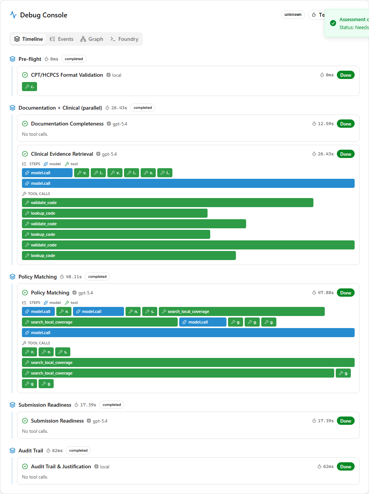
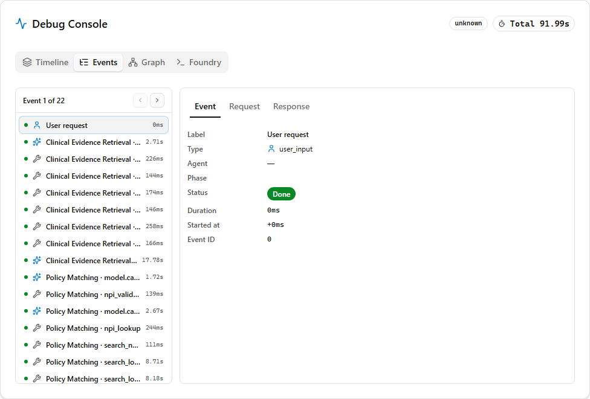
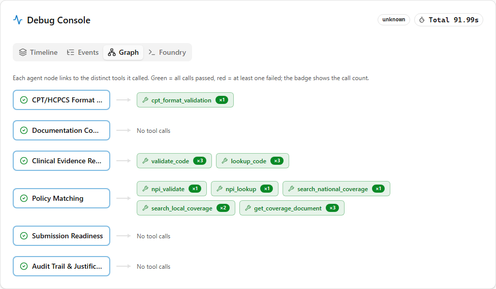
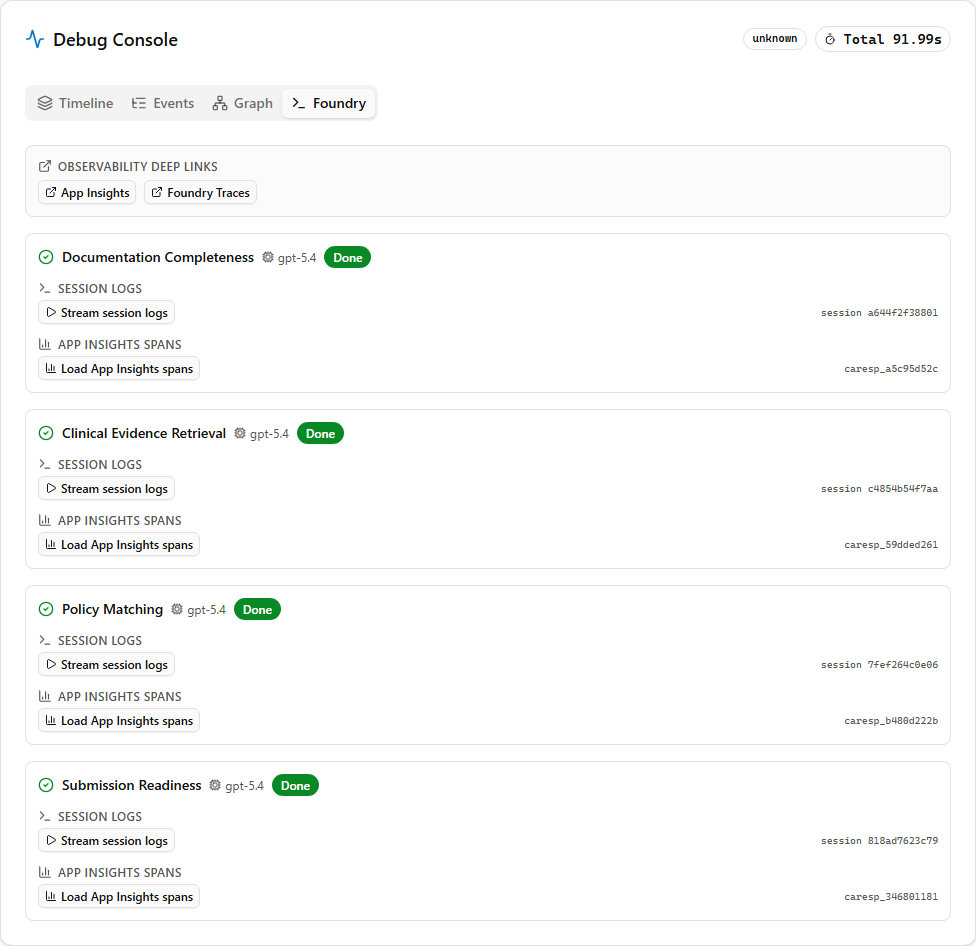

# Foundry Agent Debug Console

A built-in, technical-demo view of what the Foundry hosted agents and their MCP
tools are actually doing on each run — the Foundry equivalent of the Google ADK
Web UI debugger. It appears as a **Debug Console** tab on the review dashboard
and is populated live (via the `event: trace` SSE stream) and on the final
response (`ReviewResponse.execution_trace`).

It has four sub-views.

## Timeline

Phase → agent → step waterfall. Each agent shows its ordered **steps**: model
calls (`model.call`, blue) interleaved with MCP tool calls (green = pass, red =
fail), each bar sized by duration. Model-call spans carry token usage.

## Events

An ADK-style, navigable event inspector: a flat, ordered event list
(`user_input → llm_call → tool_call → final`) with prev/next and **Event /
Request / Response** tabs showing the raw (PHI-redacted) JSON for each step.

## Graph

An agent → tool node graph. Each agent links to the distinct tools it called;
green = all calls passed, red = at least one failed; the badge is the call count.

## Foundry

Foundry-native, live observability per agent, incorporating the microsoft-foundry
skill:

- **Stream session logs** — proxies the hosted-agent session logstream
  (`{project}/agents/{name}/sessions/{sessionId}:logstream`) into a live terminal.
- **Load App Insights spans** — queries the run's OpenTelemetry `gen_ai.*` spans
  from Application Insights (by `response_id`).
- **Deep links** — to the Foundry Traces and Application Insights blades.

## How it's wired

| Layer | Where |
|-------|-------|
| Per-tool + per-model capture (PHI-redacted) | `agents/*/mcp_toolbox.py`, `agents/*/redact.py` |
| Trace assembly (`steps`, `events`, session/response ids) | `backend/app/agents/orchestrator.py`, `backend/app/services/hosted_agents.py` |
| Trace schema | `backend/app/models/schemas.py` (`TraceStep`, `TraceEvent`, `ExecutionTrace`) |
| Foundry-native endpoints | `backend/app/routers/observability.py`, `backend/app/services/foundry_observability.py` |
| UI | `frontend/components/debug-console.tsx` |

**PHI:** tool request/response payloads are redacted in the agent container
(patient name/DOB/insurance + generic date/SSN/phone/email/long-id patterns)
before they ever enter the trace.

**RBAC:** the App Insights span query requires the backend managed identity to
have **Monitoring Reader** on the Application Insights resource (granted in
`infra/modules/role-assignments.bicep`); the logstream and deep-links use the
existing Foundry access. The panel degrades gracefully when these are absent.
