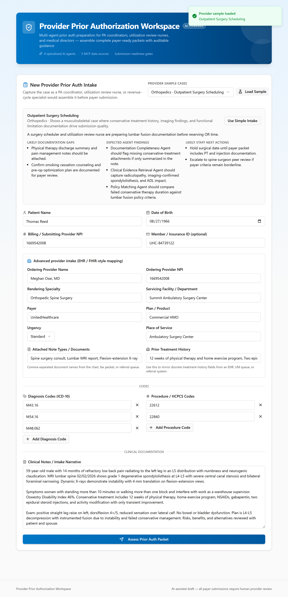
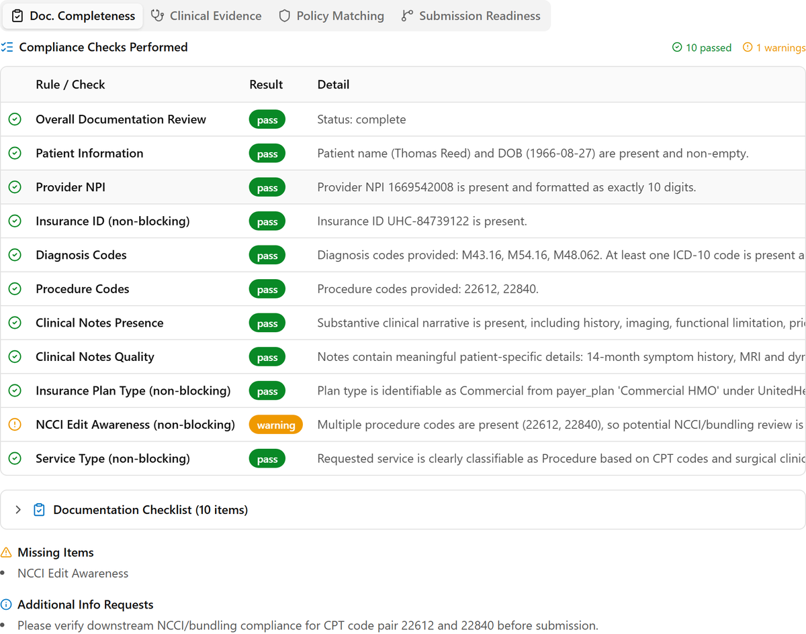
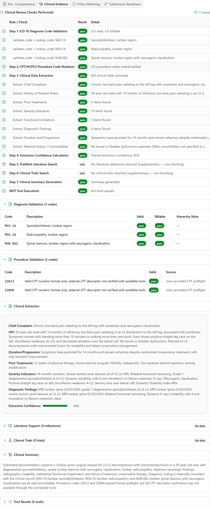
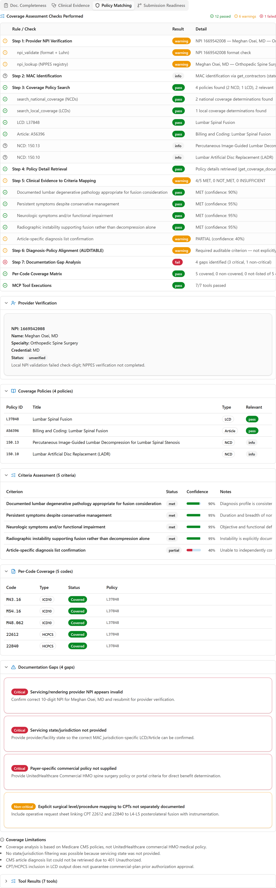
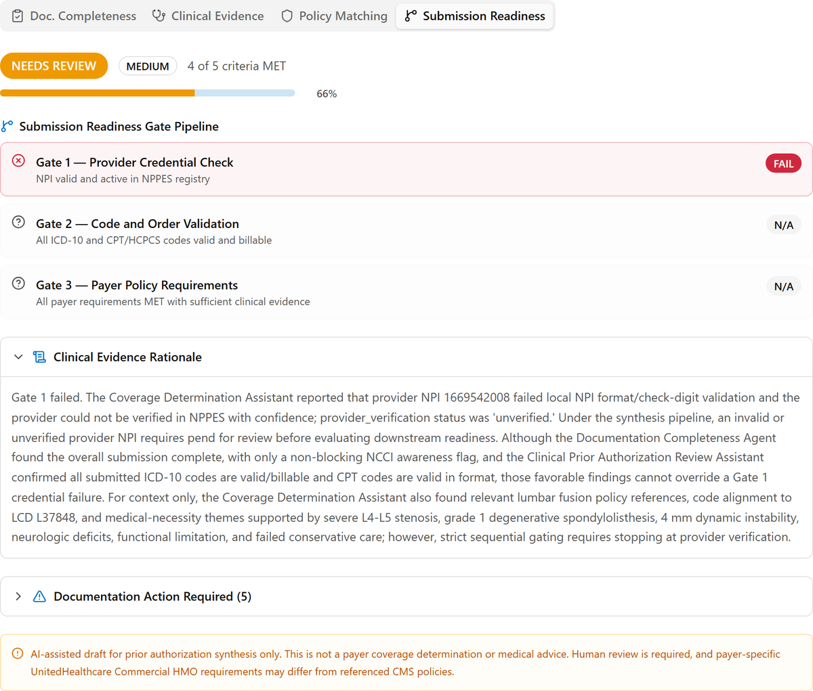
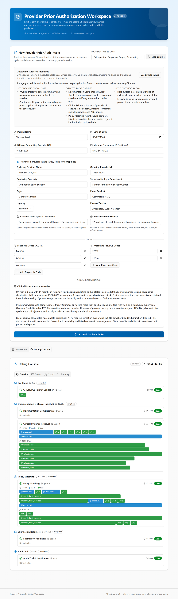

# How It Works — From Intake to Report

*A plain-language walkthrough of what happens inside the Provider Prior
Authorization assistant, following one real example from start to finish: an
orthopedic lumbar-fusion case for patient **Thomas Reed**, ending with the
report at [`report-example/Orthopedic-Spine-Surgery.pdf`](../report-example/Orthopedic-Spine-Surgery.pdf).*

This document is written for prior-authorization coordinators, utilization-review
nurses, revenue-cycle staff, and anyone who wants to understand the tool without
reading code. No technical background needed.

> **About the screenshots in this guide.** They are captured from a live run of
> the current app using the same Orthopedics sample case. Because the four agents
> reason in real time, the exact confidence score and the number of policy
> criteria can vary slightly from one run to the next. The **example PDF report**
> reflects one run (89%, HIGH, 6 of 6 criteria); the live screenshots here are
> from another, slightly more conservative run. The verdict and the reason for it
> — the provider's NPI fails Gate 1 — are the same every time.

---

## In one minute

You assemble a prior-auth packet (patient, provider, codes, clinical notes). You
press one button. About **90 seconds** later you get a **Submission Readiness
Assessment** — a clear "ready / needs review" verdict, the evidence behind it, a
checklist of anything still missing, and a polished **PDF report** you can file,
share with the surgeon or coding team, and keep for your audit trail.

Behind that button, a **team of four AI specialists** reviews the packet the way
an experienced human team would — one checks the paperwork is complete, one reads
the clinical story, one matches it to payer policy and verifies the provider, and
one makes the final go/no-go call. The tool **never submits anything to a payer**
and **always requires a human to review** before submission.

In our example, the verdict was **"Needs Review" (89% confidence, HIGH)** — the
clinical case was strong and every policy criterion was met, but the submission
was held back because the **provider's NPI number failed verification**. That one
issue is exactly the kind of avoidable problem the tool is designed to catch
*before* a packet goes to the payer.

---

## What problem this solves

Prior authorizations get denied or delayed for boring, preventable reasons: a
missing note, an invalid code, an unverified provider number, a packet that
doesn't line up with the payer's policy. Staff spend hours assembling packets and
still can't be sure they're complete until the payer pushes back.

This tool acts as a **pre-submission readiness check**. It reviews the packet
against live medical reference data and payer policy, tells you what's strong and
what's missing, and produces a documented report — so problems are fixed *before*
submission, not after a denial.

---

## The big idea: a four-specialist review

When you submit a packet, four specialists review it. Each has one job and
produces its own findings; the last one weighs everything and makes the call.

| # | Specialist | Plain-language job | Asks… |
|---|------------|--------------------|-------|
| 1 | **Documentation Completeness** | Is the packet complete and well-formed? | "Is anything missing or malformed?" |
| 2 | **Clinical Evidence** | Is the medical story strong, and are the diagnosis codes real and billable? | "Does the clinical record justify this, and are the codes valid?" |
| 3 | **Policy Matching (Coverage)** | Does it meet payer policy, and is the provider verifiable? | "Does this match coverage rules, and is the provider real?" |
| 4 | **Submission Readiness** | Final go/no-go, through three strict gates | "Is this ready to submit — yes, no, or needs review?" |

Specialists 1 and 2 work at the same time; specialist 3 then uses the clinical
findings; specialist 4 aggregates everything at the end.

---

## The journey, step by step

### Step 1 — Build the intake packet

This is the **New Provider Prior Auth Intake** screen. You can fill it by hand or
press **Load Sample** to populate a realistic case (our example uses the
*Orthopedics · Outpatient Surgery Scheduling* sample).

What the fields mean, in plain terms:

- **Patient Name / Date of Birth** — who the request is for.
- **Billing / Submitting Provider NPI** — the provider's 10-digit national ID
  number. *(NPI = National Provider Identifier.)*
- **Member / Insurance ID** — the patient's plan ID (optional).
- **Advanced intake** (ordering provider, rendering specialty, servicing
  facility, payer, plan, urgency, place of service) — the same details an EHR or
  referral system would carry. In the example: Meghan Osei, MD · Orthopedic Spine
  Surgery · Summit Ambulatory Surgery Center · UnitedHealthcare Commercial HMO.
- **Attached Note Types / Documents** — the documents in the chart or fax packet
  (e.g., spine consult, lumbar MRI report, flexion-extension X-ray).
- **Prior Treatment History** — what's been tried already (e.g., 12 weeks of
  physical therapy, injections) — important for "did conservative care fail?"
- **Diagnosis Codes (ICD-10)** — the medical condition codes (example: M43.16,
  M54.16, M48.062). *(ICD-10 = the standard diagnosis code system.)*
- **Procedure / HCPCS Codes** — the procedure being requested (example: 22612,
  22840 — a lumbar fusion with instrumentation). *(CPT/HCPCS = procedure codes.)*

The screen even hints at what the review will likely flag ("likely documentation
gaps," "expected agent findings") so the case is easy to follow during a demo.

The **Advanced provider intake** section mirrors the discrete fields an EHR or
referral system would carry (ordering provider, payer, plan, place of service,
attached documents, prior treatment history) — shown expanded in the screenshot
below.

### Step 2 — Press "Assess" and watch it work

When you submit, the review runs live and shows progress as each specialist
finishes (about 90 seconds total). Before the specialists start, the tool does a
quick **preflight** check on the procedure-code format so obvious typos are caught
immediately.

You don't have to do anything during this step — just watch the specialists
report in.

### Step 3 — Meet the four specialists (and what they found)

Each specialist checks live, trustworthy reference sources rather than guessing.
In plain terms, those sources are:

- the official **2026 diagnosis-code set** (to confirm ICD-10 codes are real and billable),
- the **national provider registry (NPPES)** (to verify the provider's NPI),
- **Medicare coverage policy** (national and local coverage determinations — the
  "rulebooks" that say what's covered and when),
- and medical-literature databases (PubMed, ClinicalTrials.gov) for supporting evidence.

#### 1. Documentation Completeness

*"Is the packet complete?"* It runs a checklist over every required field and the
clinical narrative — patient info, provider NPI, insurance ID, diagnosis and
procedure codes, the clinical-notes presence and quality, plan type, and service
type. In our example everything comes back **complete** except one **non-blocking
warning**: *NCCI Edit Awareness* — two procedure codes are present (22612 and
22840), so a downstream coding review for bundling is advised. *(NCCI = the
national rules about which codes can be billed together.)*

A warning is informational — it does **not** by itself stop a submission.

#### 2. Clinical Evidence

*"Is the medical story strong, and are the codes valid?"* It reads the clinical
notes and validates the codes.

- **Diagnosis codes** M43.16 (spondylolisthesis), M54.16 (radiculopathy), and
  M48.062 (spinal stenosis) are all confirmed **valid and billable** against the
  official code set.
- It **extracts the clinical evidence** automatically — chief complaint, history,
  prior treatments (PT, NSAIDs, gabapentin, two epidural injections), severity
  indicators (14 months of symptoms, severe L4-L5 stenosis, 4 mm instability), and
  imaging findings — at high (~95%) extraction confidence.

This is the engine that turns a wall of clinical text into structured, reviewable
evidence.

#### 3. Policy Matching (Coverage)

*"Does it meet payer policy, and is the provider real?"* This specialist does two
things:

- **Provider verification (the pivotal finding):** the submitted NPI
  **1669542008 fails validation** and **cannot** be confirmed in the national
  registry — status **UNVERIFIED**.
- **Policy matching:** it finds the relevant Medicare policy (**LCD L37848 —
  Lumbar Spinal Fusion**), checks the case against the coverage criteria (covered
  diagnosis, listed procedure, failed conservative care, supporting imaging,
  neurologic findings, fusion justified beyond decompression), and builds a
  **per-code coverage matrix** showing all five codes (M43.16, M54.16, M48.062,
  22612, 22840) **COVERED** under that policy.

So the clinical and policy side looks strong — but the provider's identity can't
be confirmed.

#### 4. Submission Readiness — the three gates

The final specialist makes the call using **three strict gates, in order**. The
gates are sequential: if an early gate fails, the later ones aren't applicable.

| Gate | Checks | Example result |
|------|--------|----------------|
| **Gate 1 — Provider Credential** | Is the NPI valid and active in the registry? | ❌ **FAIL** (NPI unverified) |
| **Gate 2 — Code & Order Validation** | Are all diagnosis/procedure codes valid and billable? | **N/A** (blocked by Gate 1) |
| **Gate 3 — Payer Policy Requirements** | Are all payer requirements met with sufficient evidence? | **N/A** (blocked by Gate 1) |

Because Gate 1 failed, the overall verdict is **NEEDS REVIEW** — even though the
coding and medical-necessity work (which Gates 2 and 3 would have rewarded) was
strong. This is deliberate: an unverifiable provider is a genuine submission
blocker, and the tool refuses to wave it through.

### Step 4 — Read the on-screen assessment

The dashboard presents the result in layers, from headline to detail:

- **Headline:** *Submission Readiness Assessment — **Needs Review***, with a
  confidence score and level (the example report shows **89%, HIGH**) and a
  one-paragraph summary explaining the strong clinical case but the Gate 1 block.
- **Verification Checks:** the individual reference-data lookups that ran
  (code validations, provider lookup, coverage searches) — all green here.
- **Payer Policy Requirements — Met vs. Not Yet Met:** in the example, 8 met
  (documentation, valid codes, policy alignment, etc.) and 2 not yet met
  (provider credential; plan-specific UnitedHealthcare policy).
- **Documentation Action Required** and **Documentation Gaps:** the concrete to-do
  list, tagged **Required** or **Recommended** (see Step 6 for the items).
- **Payer Policy References:** the actual policies consulted (LCD L37848, Article
  A56396, NCD 150.13, NCD 150.10).
- **Clinical Evidence Rationale:** a written explanation of *why* the verdict is
  what it is — readable like a reviewer's note.
- **Agent Details tabs** (*Doc. Completeness · Clinical Evidence · Policy
  Matching · Submission Readiness*): the full, drill-down findings from each
  specialist (shown in Step 3 above), including every check, the documentation
  checklist, the diagnosis/procedure validation tables, the per-code coverage
  matrix, and provider verification.

**For technical viewers**, a **Debug Console** tab sits next to "Assessment". It
exposes the live agent-and-tool execution behind the result — a timeline, an event
inspector with the raw (privacy-redacted) request/response data, the agent→tool
graph, and links to the underlying platform traces. It's optional and aimed at
engineers; the Assessment view has everything a coordinator needs.

### Step 5 — Human decision: Accept or Revise

Nothing is final until a person signs off. The **Staff Review Decision** panel
lets the reviewer enter their name and choose **Accept AI Assessment** or **Revise
Assessment**. This keeps a human firmly in control — the tool advises; the staff
member decides. The **Assessment Audit Trail** records when the review started and
finished, the confidence scores, and which data sources were consulted.

### Step 6 — The PDF report

Finally, the tool generates a shareable, file-ready PDF —
[`Orthopedic-Spine-Surgery.pdf`](../report-example/Orthopedic-Spine-Surgery.pdf)
in our example. It's the same assessment, packaged as a clean four-page document
you can attach to the chart, send to the surgeon or coding team, or keep for
compliance. Every page is watermarked **"AI-assisted draft — human review
required before submission."**

The report has eight sections:

| Section | What it contains |
|---------|------------------|
| **1. Executive Summary** | The headline: status (**Needs Review**), patient, provider NPI, codes, confidence (89% HIGH), and the plain-English summary. |
| **2. Clinical Evidence Assessment** | Provider + status (UNVERIFIED), matched payer policies, the per-code coverage matrix (all COVERED), and the clinical evidence pulled from the notes. |
| **3. Criterion-by-Criterion Evaluation** | The six policy criteria, each marked **met** with a confidence score and the key evidence. |
| **4. Validation Checks** | Provider-credential result, the diagnosis-code validation table, and the documentation checklist. |
| **5. Submission Readiness Rationale** | The full reasoning for the verdict, including which gate failed and why. |
| **6. Documentation Gaps** | The prioritized to-do list — **Critical** vs. **Non-critical** — each with a specific action. |
| **7. Audit Trail** | Data sources consulted, start/finish timestamps, and confidence scores. |
| **8. Compliance Notes** | The rules the assessment followed (e.g., provider check required, human review required). |

*(If a staff member overrides the AI verdict, the regenerated report adds a
**Section 9 — Staff Override Record** documenting who changed what and why.)*

---

## Reading this example's verdict

**Why "Needs Review"?** Everything clinical and policy-related was strong — the
coverage criteria met, all codes valid and covered, documentation complete. But
the provider's NPI (1669542008) **failed the validity check and could not be
confirmed** in the national registry. The strict gate sequence treats an
unverified provider as a hard stop, so the packet is held for review rather than
marked ready.

**What would staff do next?** The report's Documentation Gaps make it explicit:

- **[Critical] Validated provider identity** — confirm the correct 10-digit NPI
  for Meghan Osei, MD.
- **[Critical] Plan-specific commercial policy** — pull the actual UnitedHealthcare
  Commercial HMO lumbar-fusion policy (the tool matched *Medicare* policy as a
  proxy; the real payer here is commercial).
- **[Recommended]** clarify the procedure-coding construct, attach the formal MRI
  and X-ray reports, and add dates for the conservative-care history.

Fix the NPI and obtain the commercial policy, re-run the assessment, and the case
should clear Gate 1 and proceed.

---

## Badge & status legend

| You'll see | It means |
|------------|----------|
| **pass** / green | The check succeeded. |
| **warning** / amber | Worth a look, but **not** a blocker on its own. |
| **fail** / red | A real problem that blocks readiness. |
| **complete / incomplete** | A documentation checklist item is present or missing. |
| **met / not met / insufficient** | A payer policy criterion is satisfied, not satisfied, or lacks enough evidence. |
| **Required / Recommended** (or Critical / Non-critical) | How urgent a gap is — Required must be fixed before submitting. |
| **Gate FAIL / N/A** | A readiness gate failed, or wasn't reached because an earlier gate stopped the line. |
| **Confidence %** + LOW/MED/HIGH | How sure the tool is of its own assessment. |

---

## Important things to remember

- **It's a draft, not a decision.** The output prepares a submission; it is **not**
  a payer coverage determination or medical advice.
- **A human must review** before anything goes to a payer. The tool can't and
  doesn't submit.
- **Medicare policy is used as a proxy.** Coverage matching reflects Medicare
  LCDs/NCDs. Commercial and Medicare Advantage plans (like the UnitedHealthcare
  plan in the example) may have different rules — hence the "obtain plan-specific
  policy" gap.
- **Patient information is protected** in the behind-the-scenes records the tool
  keeps for traceability.

---

## Glossary

- **Prior authorization (PA):** a payer's required approval before a procedure.
- **NPI:** National Provider Identifier — a provider's 10-digit ID. **NPPES** is
  the national registry where NPIs are looked up.
- **ICD-10:** the standard diagnosis-code system. **CPT / HCPCS:** procedure codes.
- **LCD / NCD:** Local / National Coverage Determination — Medicare's policies for
  what's covered and under what conditions.
- **NCCI edits:** national rules about which procedure codes may be billed together.
- **Conservative care:** non-surgical treatment (e.g., physical therapy,
  injections) typically required before a payer approves surgery.
